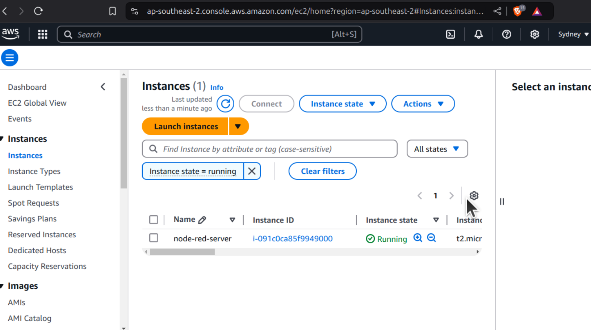
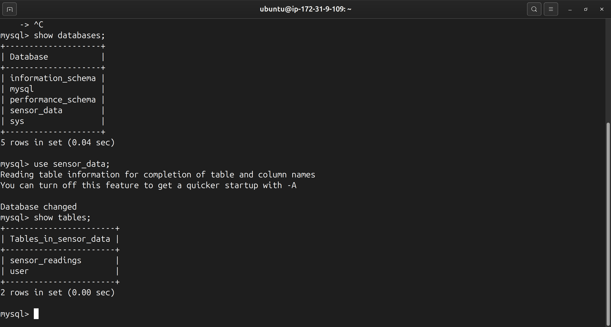
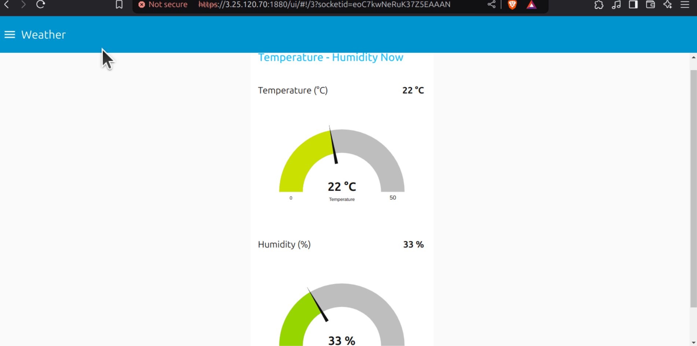
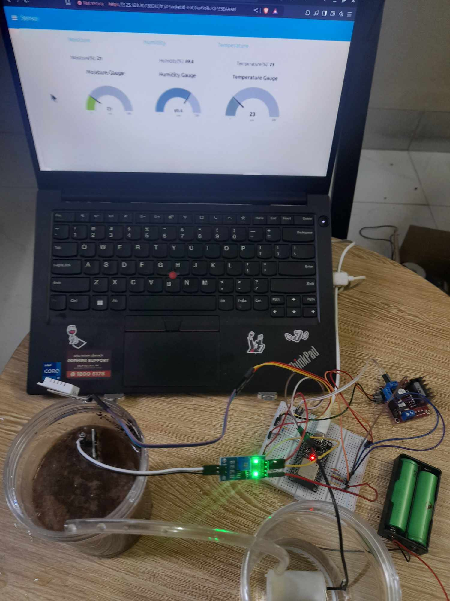

# Hệ thống tưới tiêu tự động (v2)

## Mở Đầu
Đây là dự án cuối kỳ cho môn học "Phát triển ứng dụng IoT" tại trường Đại học Khoa học Tự nhiên - Đại học Quốc gia Hà Nội (HUS-VNU) của tôi. Dự án được phát triển từ [Dự án giữa kỳ](https://github.com/P8USea/IoT-MidTerm-Project) cùng tên, nhưng đã được cải tiến đôi chút.

***Link [Node-RED flow](https://3.25.120.70:1880/#)***

***Link [Node-RED Dashboard](https://3.25.120.70:1880/ui/#!/0?socketid=Wab-lakc8WGQwlHIAAAY)***
## Những thay đổi
### Phần cứng: 
- Không có quá nhiều sự thay đổi ở phần cứng. Tôi vẫn sử dụng các linh kiện: 
  + ESP32 DOIT Devkit V1
  + L298N Motor Driver
  + Máy bơm nước mini (3-12V)
  + Cảm biến độ ẩm đất
  + 2 cell Pin 18650 3.7V 20A
- Ngoài ra, tôi còn thêm module cảm biến DHT22 để theo dõi nhiệt độ - độ ẩm ở lần này

### Phần mềm:
- Đây là phần tôi có nhiều sự thay đổi và cải tiến nhất ở dự án lần này so với dự án giữa kỳ. Bao gồm:
  + Tạo một máy ảo từ một EC2 instance của AWS phục vụ việc chạy node-red server trên Internet thông qua IP công khai
  
  + Tạo một kho lưu trữ (Database) trên node-red server bằng MySQL phục vụ việc lưu trữ trong thời gian dài 
    
  + Tích hợp thêm các API để giao tiếp client-server dễ dàng:
  + [APIs.webm](https://github.com/user-attachments/assets/ff30f293-d87e-4699-b8df-cf1cdfe3b730)
  
  + Thêm API gửi email cảnh báo tới người dùng khi có sự kiện bằng server smtp.gmail.com
  + +Thêm API theo dõi thời tiết sử dụng API của[OpenWeatherMap](https://openweathermap.org/)
    
  + Tạo UI WebDashboard bằng node-red-dashboard
  + Bảo mật: Thêm chứng chỉ TLS cho server, thêm bước Authentication cho giao diện node-red flow
  + Code chính:
    * Tổ chức lại các khai báo vào file config.h để tiện tinh chỉnh
    * Thêm hàm DHT_22_Reader() để đọc/gửi giá trị nhiệt độ - độ ẩm không khí
    * Thêm hàm soil_Moisture_Reader() để đọc/gửi giá trị độ ẩm đất
    * Thêm hàm soil_Moisture_Handler() để xử lý dữ liệu độ ẩm đất (Vì giá trị độ ẩm đất quyết định việc tưới nước)
    * Thêm hàm warning() để đưa ra cảnh báo qua email
    * Thêm hàm gotoSleep() để đưa ESP vào Deep Sleep Mode
    * Loại bỏ hàm sensor_Handler(), mqttPublish()
    * Thay thế delay() bằng Ticker để tránh gián đoạn quá trình truyền nhận của ESP32

## Kết quả
- Sau khi áp dụng các thay đổi đã kể trên, tôi có được:
  + Giao diện Web Server:
  + [Dashboard.webm](https://github.com/user-attachments/assets/45dfb9f8-c857-4eff-8fb2-5ff64f0ecbe7)

  + Database:
  + [Database.webm](https://github.com/user-attachments/assets/f3b4f325-f3b2-4b1a-a1a9-1ee755502874)

  Note: Tôi tính dùng data này để huấn luyện một mô hình học máy đơn giản thông qua sự liên hệ giữa (Nhiệt độ - độ ẩm không khí) - Độ ẩm đất. Tuy nhiên do tập dữ liệu của tôi chưa đủ lớn (hoặc do cảm biến của tôi chưa được đủ chính xác :33) nên tôi sẽ dành nó cho tương lai.

  + Điều khiển từ người dùng tới hệ thống tưới tiêu:
  + [User-Control.webm](https://github.com/user-attachments/assets/9600de5a-b50b-43da-87b2-4c6670dd718b)
    
  + Cảnh báo qua email khi có sự kiện:
  + [Send-Mail.webm](https://github.com/user-attachments/assets/0476eb15-d845-4f93-8544-e60fe4ed50f7)

  + Setup hệ thống:
    
  + Hoạt động của hệ thống nói chung:
  + [Working](https://github.com/user-attachments/assets/8481a119-8018-49c2-a815-163c61927194)

## Kết Luận
- Dự án của tôi trên cơ bản đã đáp ứng được các yêu cầu của một "Hệ thống tưới tiêu tự động" bao gồm:
  + Theo dõi các yếu tố Nhiệt độ - Độ ẩm không khí - Độ ẩm đất
  + Tự động tưới nước khi xuống dưới ngưỡng ẩm đã định
  + Người dùng theo dõi và điều khiển hệ thống thông qua trình duyệt Web (Tưới nước, set ngưỡng ẩm, Bật/tắt tự động tưới)
  + Lưu dữ liệu vào cơ sở dữ liệu để phục vụ mục đích truy/xuất sau này
  + Gửi email cảnh báo tới người dùng khi có sự kiện (Vượt quá nhiệt độ, độ ẩm không khí, độ ẩm đất v.v...)
  + Bảo mật cho Web/MQTT (TLS, https)
- Sau khi hoàn thành dự án này, tôi đã học và làm được một số thứ liên quan tới các công nghệ:
  + PlatformIO: Môi trường phát triển cho các ứng dụng IoT
  + Node-RED: Trực quan hóa các luồng, các giao thức theo dạng lập trình kéo thả và phát triển APIs/Dashboard
  + Giao thức MQTT và các broker trong MQTT
  + Chứng chỉ TLS/SSL

- Tôi đã rất vui khi hoàn thành dự án này, không chỉ trong phạm vi bài tập lớn cuối kỳ của môn học mà còn là một trải nghiệm học hỏi và tìm tòi rất thú vị; cũng như thành quả tôi đạt được còn nhiều hơn là điểm số. Hiện tại hệ thống đang ở mức "chạy được" và sẽ được cập nhật thêm trong tương lai.
 F <333 !!!

    

